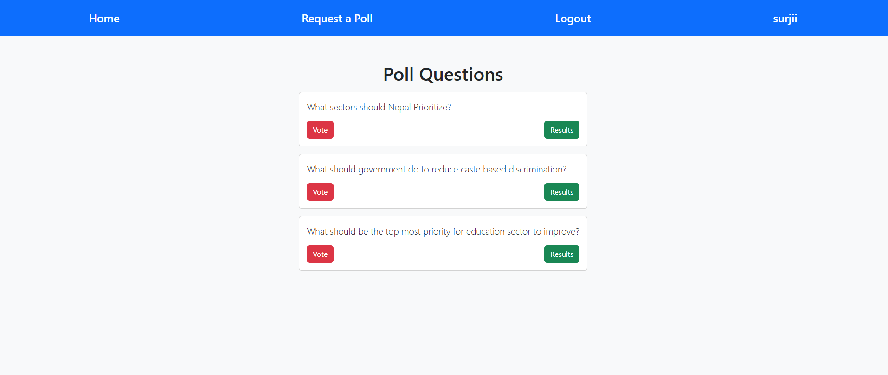
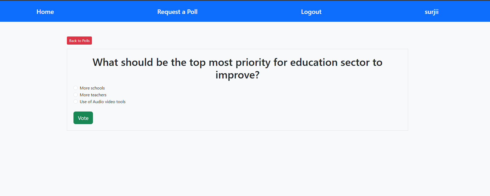
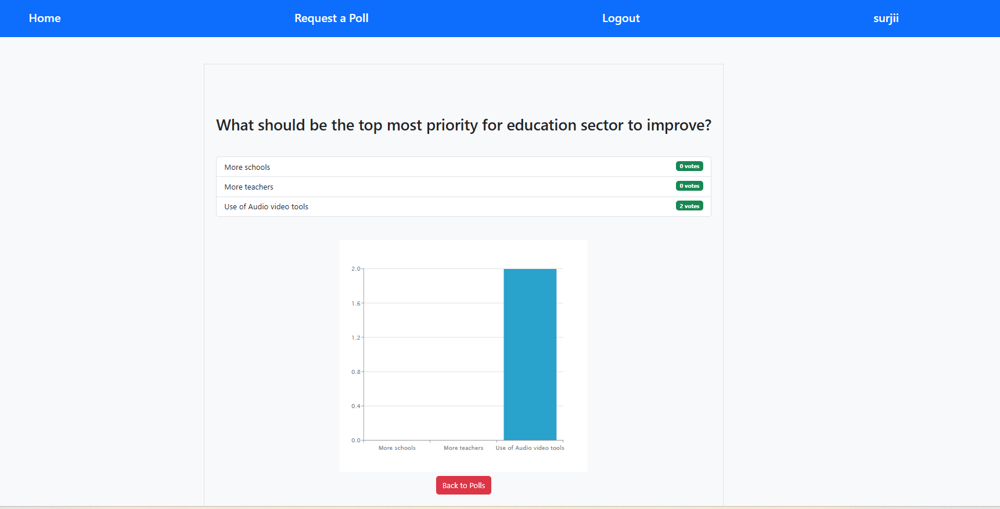
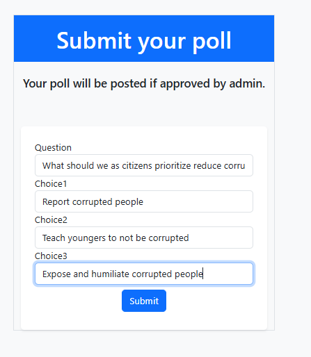
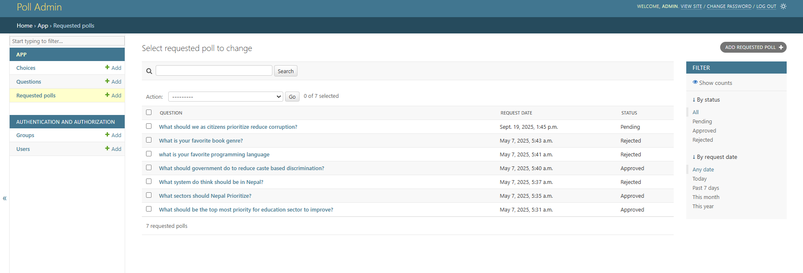

# 🗳️ Poll – Vote on Admin-Published Polls  

Poll is a simple yet engaging web application where users can vote on polls published by the admin.  
Each user can vote **only once per poll** and see the results in both **numbers and charts**.  
Users can also submit their own poll questions and choices for admin approval and publishing.  

---

## ✨ Key Features  
- **🔑 User Authentication** – Secure login and registration system using Django authentication  
- **🗳️ Voting System** – Users can vote once per poll  
- **📊 Results Display** – View poll results with live counts and charts  
- **📝 Submit Polls** – Users can request new polls to be reviewed and approved by the admin  

---

## 🚀 Technologies Used

| Purpose      | Technologies              |
|-------------|--------------------------|
| Frontend    | HTML, CSS, JavaScript     |
| Backend     | Django (Python)           |
| Database    | SQLite                   |

---

## 🖼️ Snapshots of the Project
### 🏠 Home Page

---
### ✍️ Voting Page

---
### 📖 Result Page

---
### ✍️ Submit vote Page

---
### 😁Admin Page

## ⚙️ Setup Instructions

### ✅ Prerequisites
- Python 3.x installed  
- `pip` installed  
- A virtual environment tool (recommended)  

---

###  Steps to Run the Project

1. **Clone the Repository**

      git clone https://github.com/Surja11/poll.git
      cd Bibliobuzz

2. **Create a Virtual Environment**

      (Optional but Recommended)
      On Windows:

      python -m venv venv
      venv\Scripts\activate

      On macOS/Linux:

      python3 -m venv venv
      source venv/bin/activate

3. **Install Dependencies**

      pip install -r requirements.txt

4. **Apply Migrations**

      python manage.py makemigrations 
      python manage.py migrate

5. **Create Superuser (Optional – for Admin Access)**

      python manage.py createsuperuser

6. **Run the Development Server**

      python manage.py runserver

7. **Access the Application**

      Open your browser and go to:
      http://127.0.0.1:8000/